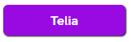
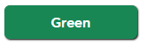
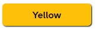
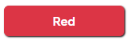
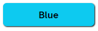
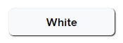
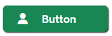
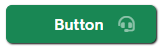
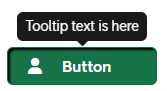

# Buttons

## Descripiton
Main style framework is [Bootstrap](https://getbootstrap.com/docs/5.2/components/buttons/).  
Some button styles is overwritten in [components.css](./../src/styles/components.css) file by Telia digital design guidence.

---

## Simple buttons
### Telia purple


```html
<button class="btn btn-telia">Telia</button>
```

### Green


```html
<button class="btn btn-success">Green</button>
```

### Yellow


```html
<button class="btn btn-warning">Yellow</button>
```

### Red


```html
<button class="btn btn-danger">Red</button>
```

### Light blue


```html
<button class="btn btn-info">Blue</button>
```

### White


```html
<button class="btn btn-light">White</button>
```

---

## Buttons with icons
Icons is used from [Font Awesome](https://fontawesome.com/v5/search)  
Spacing `m*-*` utilities is from [Bootstrap](https://getbootstrap.com/docs/4.0/utilities/spacing/)

### Left icon


```html
<button class="btn btn-success text-start">
    <em class="fa-solid fa-user ms-2 me-3"></em>
    <span>Button</span>
</button>
```


### Right icon (transparent)


```html
<button class="btn btn-success mb-1 text-end">
    <span>Button</span>
    <em class="fas fa-headset my-auto mx-2" style="opacity: .5;"></em>
</button>
```

---

## Button click
To open link in new tab need to call `openTab('https\://your.link')` function from [utils.js](./../src/js/utils.js)

``` html
<button class="btn btn-warning"
        onclick="openTab('https\://your.link')">
        Button
</button>
```

---

## Button with tooltip


Basic tooltip parameters:  
* `data-bs-toggle="tooltip"` - defines that it has tooltip  
* `data-bs-placement="top"` - where tooltip will be displayed on element `top` | `right` | `bottom` | `left`
* `title="Tooltip text is here"` - tooltip content

Advanced parameters defined in [Bootstrap](https://getbootstrap.com/docs/4.0/components/tooltips/) documentation


```html
<button class="btn btn-success text-start"
        data-bs-toggle="tooltip"
        data-bs-placement="top"
        title="Tooltip text is here"
        onclick="openTab('https\://your.link')">
    <em class="fa-solid fa-user ms-2 me-3"></em>
    <span>Button</span>
</button>
```

---

**Check also:**
* [Image button](image-button.md)
* [Icon](icon.md)

---

<br>
<br>

&copy; 2023 Nebula Team, [Telia Company](https://telia.se)
