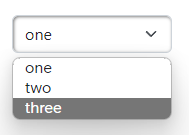

# Dropdown

## Descripiton
Main style framework is [Bootstrap](https://getbootstrap.com/docs/5.2/components/dropdowns/).  
Some button styles is overwritten in [components.css](./../src/styles/components.css) file by Telia digital design guidence.  

Adding dropdown could be splitted in 3 steps.
1. Add `<select>` html tag with `id` attribute
2. Create `function` to populate data into dropdown
3. Create `function` which does something when dropdown value is selected

## Example

### 1. Add tag
``` html
<select class="form-select" id="my-select" onchange="changeSelection()"></select>
```
`class="form-select"` - required if you want to apply bootstrap style.

### 2. Add function to add selection options

``` javascript
function setSelections() {
    let options;
    const selections = ['one', 'two', 'three'];
    for (let selection of selections) {
        options += getOptionHtmlTag(selection, selection);
    }
    getById('my-select').innerHTML = options;
}
```

>**Important:** Add method call to `setup()` method which is called on page load

### 3. Add function to handle dropdown change event
``` javascript
let selected = '';

function changeSelection() {
    selected = getValue('my-select');
    // do something with value here or in other function
}
```

### Result


---

<br>
<br>

&copy; 2023 Nebula Team, [Telia Company](https://telia.se)
