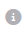
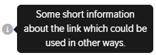

# Icons

## Descripiton
Icon button can be used as a button, as a modal toggle or just information tooltip.  
Icons (free) could be used from [Font Awesome](https://fontawesome.com/v5/search).

---

## Example

### Icon link button
Could be used as additional information link near button.
``` html
<a href="https://diva.teliacompany.net/" target="_blank">
    <i class="fa-solid fa-circle-info color-gray"></i>
</a>
```
Icon is taken from https://fontawesome.com/icons/info-circle?s=solid&f=classic  
**Result:**   



### Icon tooltip
Could be used as additional information tip near button.
``` html
<span data-bs-toggle="tooltip"
    data-bs-placement="right"
    title="Some short information about the link which could be used in other ways.">
    <i class="fa-solid fa-circle-info color-gray"></i>
</span>
```

**Result:**  



More tooltip configuration: [Bootstrap Tooltip](https://getbootstrap.com/docs/5.2/components/tooltips/)


---

<br>
<br>

&copy; 2023 Nebula Team, [Telia Company](https://telia.se)
