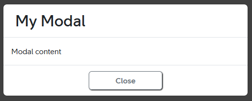

# Modal

## Descripiton
Modal is popup window where you can see something you don't see in page.  
Main style framework is [Bootstrap](https://getbootstrap.com/docs/5.2/components/modal/). 

---

## Example

### Modal

Modal can contain header body and footer. Modal should have `id` attribute. That allows to open modal by using `data-bs-toggle="modal"` and `data-bs-target="#myModal"` attributes on clickable HTML tag (`<span>`, `<div>`, `<button>`, etc)
``` html
<div class="modal fade" id="myModal" tabindex="-1" aria-labelledby="myModalLabel" aria-hidden="true">
    <div class="modal-dialog">
        <div class="modal-content">
            <!-- HEADER -->
            <div class="modal-header p-4" style="vertical-align: middle;">
                <h2 class="modal-title" id="myModalLabel">My Modal</h2>
            </div>

            <!-- BODY -->
            <div class="modal-body">
                Modal content
            </div>

            <!-- FOOTER -->
            <div class="modal-footer">
                <div class="m-auto">
                    <button class="btn btn-outline-secondary" data-bs-dismiss="modal">Close</button>
                </div>
            </div>
        </div>
    </div>
</div>
```
**Result:**   



More modal configuration: [Bootstrap Modal](https://getbootstrap.com/docs/5.2/components/modal/)


---

<br>
<br>

&copy; 2023 Nebula Team, [Telia Company](https://telia.se)
